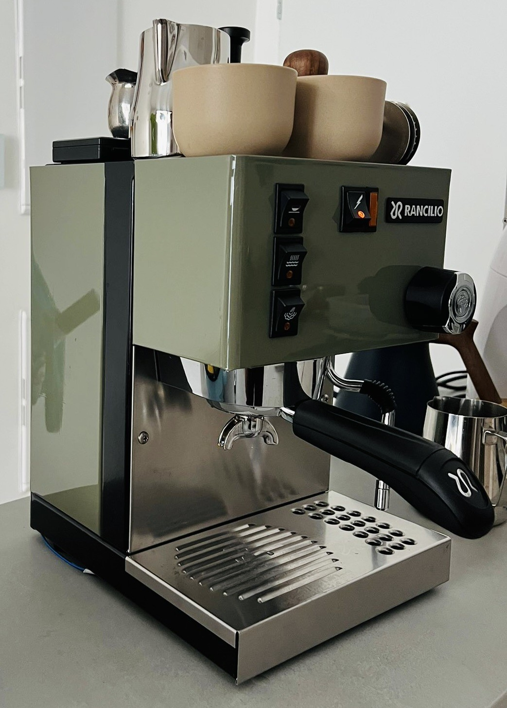
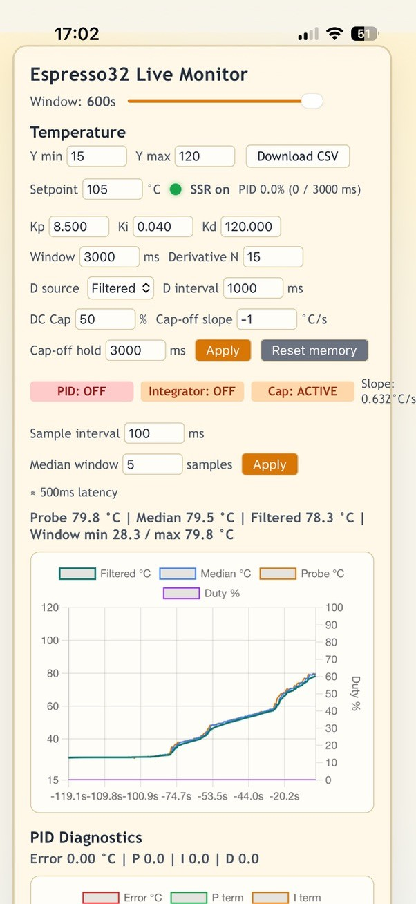
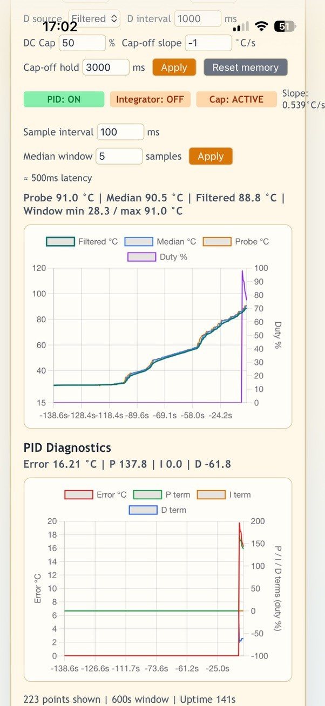
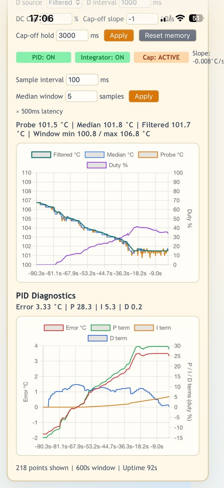
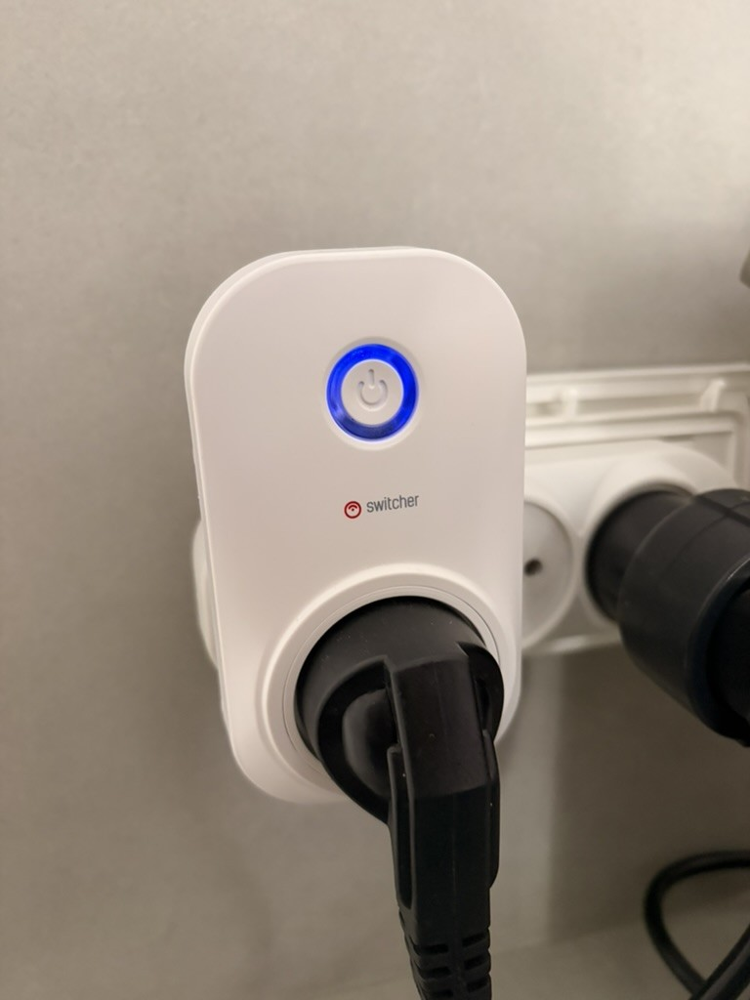
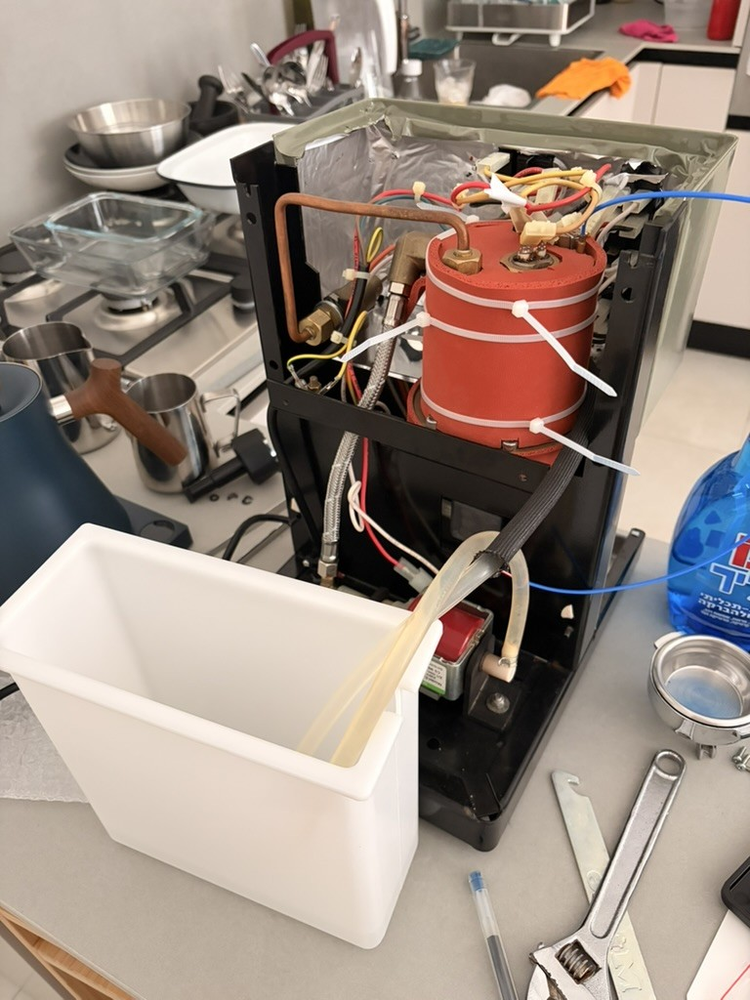
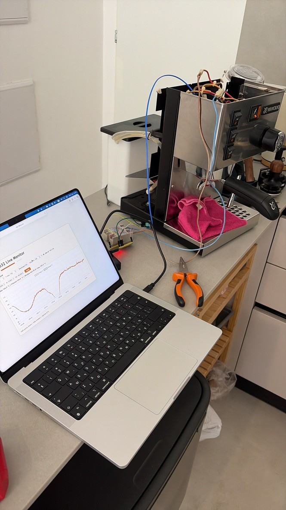

# Espresso32

Firmware for an ESP32-S3-based PID temperature controller for an espresso machine boiler, with a built-in web dashboard for live monitoring and tuning.

<p align="center">
  
</p>

<p align="center">
  
  
  
</p>
<p align="center"><em>Warmup stages on the live dashboard: initial heating (PID off), approach to setpoint (integrator off), and full PID control once at temperature.</em></p>

## What it does

- Reads boiler temperature from a MAX31855 thermocouple amplifier.
- Runs a PID loop (with a linear-regression derivative filter for noise rejection and a duty-cycle cap with slope-based override for fast recovery after flushes) to drive an SSR controlling the heating element.
- Drives a "ready" LED once the temperature has settled near setpoint.
- Serves a live web dashboard (temperature/PID charts, history, CSV export) over WiFi, plus a JSON API.
- Reads config (WiFi credentials, pin assignments, PID gains, etc.) from `config.yaml` on the device's SPIFFS filesystem at boot, falling back to compiled-in defaults.
- Optional pressure sensing support (present in code, currently disabled — no sensor wired up).

## Code layout

- `src/main.cpp` — setup/loop, wiring the modules below together, plus a watchdog and a stuck-PID auto-restart safeguard.
- `include/config`, `src/config` — `AppConfig`: default settings and the `config.yaml` loader/saver.
- `include/control`, `src/control` — control logic: `PidController`, `LinearDerivativeFilter`, `SsrController` (PID + duty cycle → SSR pin), `DcCapOverride` (bypass the duty cycle cap on fast temperature drops), `ReadyHysteresis`/`ReadyIndicator` (ready-LED state machine).
- `include/sensing`, `src/sensing` — `TemperatureSensor` (MAX31855) and `PressureSensor` (analog transducer), both built on a shared `SensingBase` sampling/median-filter helper.
- `include/models` — plain telemetry structs (`TemperatureTelemetry`, `PressureTelemetry`).
- `include/server`, `src/server` — `TelemetryServer`: WiFi connection, HTTP server, JSON/CSV APIs, and in-memory history ring buffers.
- `data/` — the web dashboard (`index.html`, `app.js`, `styles.css`, using Chart.js from a CDN) and the runtime `config.yaml`, both flashed to the device's SPIFFS partition.
- `test/` — Unity tests for the control-logic modules, run on the `native` PlatformIO environment (no hardware needed).

## Building & flashing

Requires [PlatformIO](https://platformio.org/).

```sh
# Edit data/config.yaml with your WiFi credentials first (see below).
pio run -t upload          # build and flash firmware
pio run -t uploadfs        # upload data/ (dashboard + config.yaml) to SPIFFS
pio device monitor         # serial log at 115200 baud
```

Run the native unit tests (control logic only, no hardware):

```sh
pio test -e native
```

## Configuration

Before flashing, set your WiFi network in `data/config.yaml`:

```yaml
wifi:
  ssid: "YOUR_WIFI_SSID"
  password: "YOUR_WIFI_PASSWORD"
```

This file is uploaded to the device's filesystem via `pio run -t uploadfs` and is read at boot; it is not compiled into the firmware. `include/config/AppConfig.h` holds compiled-in fallback defaults (used only if `config.yaml` fails to load) along with default pin assignments and PID gains — adjust to match your wiring/hardware if it differs from the pins documented in that file.

## Hardware

Built for a `4d_systems_esp32s3_gen4_r8n16` board. Default pin mapping (see `include/config/AppConfig.h` and the sensing/control headers):

| Signal | Pin |
| --- | --- |
| MAX31855 CLK / CS / DO | 11 / 12 / 13 |
| SSR control | 10 |
| Ready LED | 2 |
| Pressure ADC (optional, disabled by default) | 4 |

Power to the machine itself is switched by a Switcher smart plug, so it can be turned on remotely from a phone before getting home — the controller then takes over boiler regulation once it's powered up.

<p align="center">
  
</p>

## Development

<p align="center">
  
  
</p>
<p align="center"><em>Fitting the thermocouple, SSR wiring, and boiler insulation; early bench testing with the first live temperature readout.</em></p>
